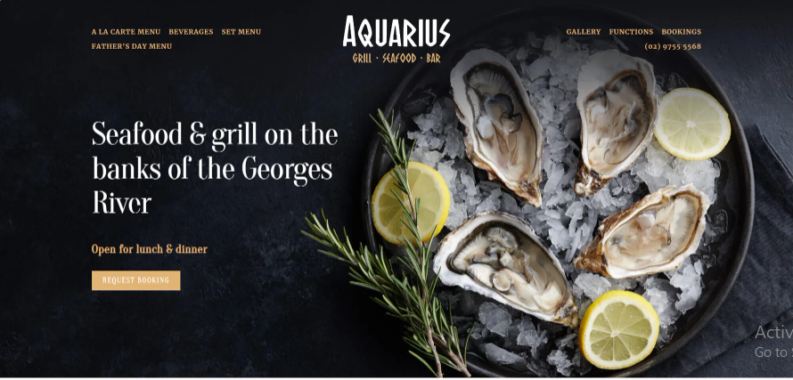
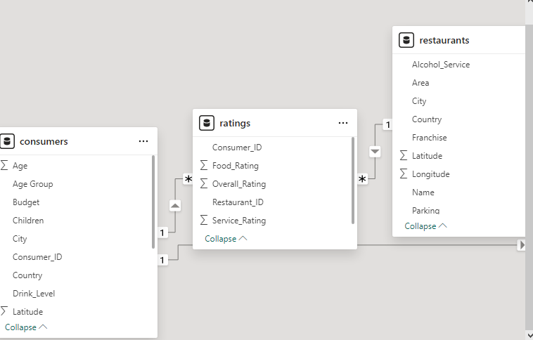
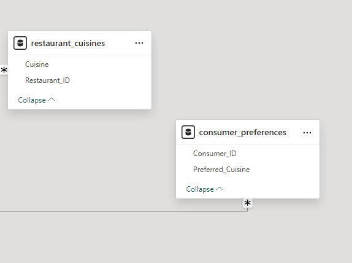
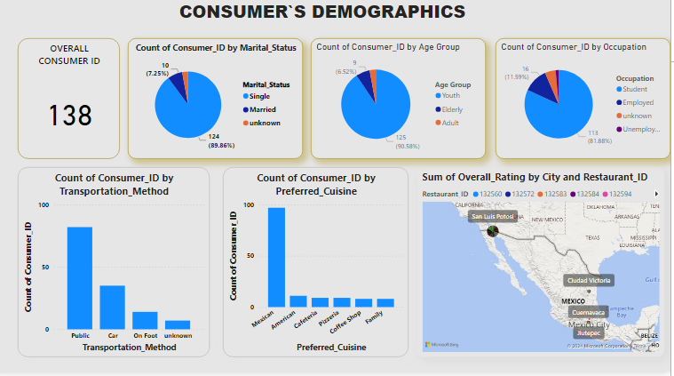

# Restaurant Ratings Analysis

## Introduction

This is a power BI project on **restaurant rating** which contains information about restaurants in Mexico. 
A customer survey was carried out in this city in 2012 to collate information about each restaurant, their cuisines, information about their consumers and the preferences of the consumers.

**_Disclaimer_** : _All datasets and report do not represent any company, institution or country, but just a dummy dataset to demonstrate capabilities of power BI._

## Problem Statement

- 	What can you learn from the highest rated restaurants? Do consumer preferences have an effect on ratings?
- 	What are the consumer demographics? Does this indicate a bias in the data sample?
- 	Are there any demand & supply gaps that you can exploit in the market?
- 	If you were to invest in a restaurant, which characteristics would you be looking for?

## Skills Demonstrated

- 	Data cleaning
- 	Conditional formatting
- 	Using first row as header
- 	Transforming data
- 	Quick Measures etc.

## DATA SOURCING

The Data source is from a customer survey was carried out in this city in 2012 to collate information about each restaurant, their cuisines, information about their consumers and the preferences of the consumers. Link: https://drive.google.com/file/d/1c1HKM8UTqwWOgexRLOtEJuxjBiA2N6xf/view?usp=drive_link

## DATA TRANSFORMATION

Data was efficiently cleaned transformed with the power Query Editor of power BI.[a screenshot of some steps applied] Steps includes;
- 	Making first row as header 
- 	Value to find and Replace value 
- 	Datatype then Change from Decimal or text to whole number
- 	Conditional formating
- 	Using first row as header
- 	Close and apply

## MODELLING

Power BI automatically connected related tables resulting in an Entity Relationship model. ‘Restaurant Rating’ table is the model

## ANALYSIS &VISUALIZATIONS

We can see that from the dashboard shows
- 	The highest rated restaurants top 5
- 	The food or cuisine preferred by customers which is the Mexican cuisine.
- 	Their average ratings on overall ratings, service ratings, food ratings

- 	From the above dashboard shows the consumer preferences and consumer demographics on how it affects the restaurant ratings and their cuisines. 
- 	It also indicates the demand & supply gaps that is exploited in the market.

## CONLUSION/ RECOMMENDATION

The analysis reveals several actionable insights:
- 	Consumer preferences and demographics play a crucial role in determining restaurant ratings.
- 	There are identifiable demand and supply gaps in the market that can be exploited.
- 	Key characteristics such as cuisine type, location, and service quality are critical for restaurant success. By addressing the recommendations and leveraging the insights from the dataset, business entrepreneurs and investors can make more informed and strategic decisions in the restaurant industry in Mexico. This can lead to better customer satisfaction, higher ratings, and ultimately, more successful restaurant ventures.😊

